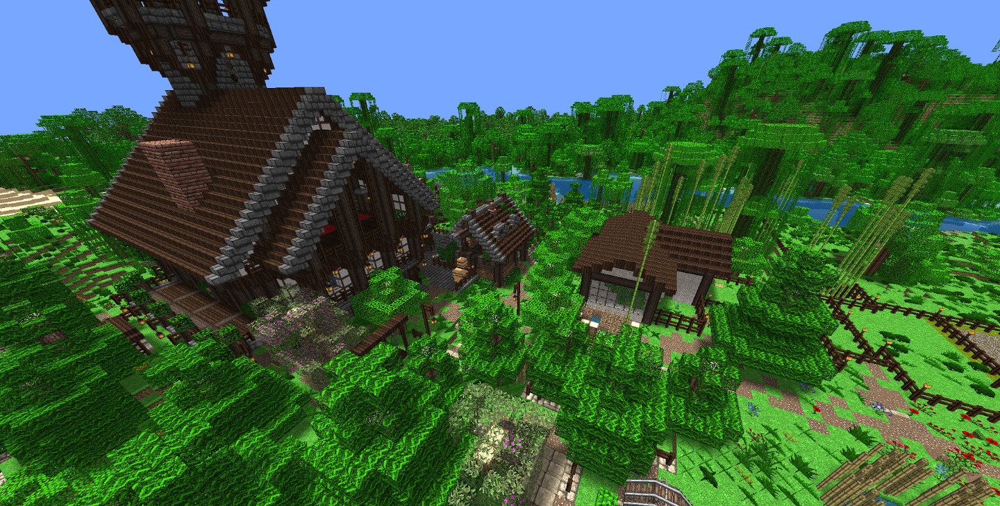

# Minecraft Web Viewer
[](https://GitHub.com/Arcus92/minecraft-web-viewer/releases/)
[](https://github.com/Arcus92/minecraft-web-viewer/releases)
[](https://github.com/Arcus92/minecraft-web-viewer/blob/main/LICENSE)
[](https://3dmap.david-schulte.de/#w=world&tx=196&tz=382.4&cx=155&cy=93.7&cz=402.6)

The **Minecraft Map Viewer** lets you explore your Minecraft worlds in 3D within your web browser.
[Try the demo!](https://3dmap.david-schulte.de/#w=world&tx=196&tz=382.4&cx=155&cy=93.7&cz=402.6)



## Usage

- Your Minecraft world must be converted via the [Minecraft Web Exporter](https://github.com/Arcus92/minecraft-web-exporter).
- Download the [latest release](https://github.com/Arcus92/minecraft-web-viewer/releases) or [compile from source](#compile-from-source).
- Upload the viewer files to a static web server.
- Upload the converted world files in the same directory.

## Compiling from source

Install [Node.js](https://nodejs.org/) with the Node Package Manager *(NPM)*.

```shell
git clone https://github.com/Arcus92/minecraft-web-viewer.git
cd minecraft-web-viewer
npm ci
```

### Build

```shell
npm run build
```

You can find the output files in `minecraft-web-viewer/dist`.

### Start a debug server

```shell
npm run dev
```

## Notice

this project wouldn't have been possible without:
- [Three.js](https://github.com/mrdoob/three.js/)
- [Pako](https://github.com/nodeca/pako)

## License

```text
MIT License

Copyright (c) 2022 David Schulte

Permission is hereby granted, free of charge, to any person obtaining a copy
of this software and associated documentation files (the "Software"), to deal
in the Software without restriction, including without limitation the rights
to use, copy, modify, merge, publish, distribute, sublicense, and/or sell
copies of the Software, and to permit persons to whom the Software is
furnished to do so, subject to the following conditions:

The above copyright notice and this permission notice shall be included in all
copies or substantial portions of the Software.

THE SOFTWARE IS PROVIDED "AS IS", WITHOUT WARRANTY OF ANY KIND, EXPRESS OR
IMPLIED, INCLUDING BUT NOT LIMITED TO THE WARRANTIES OF MERCHANTABILITY,
FITNESS FOR A PARTICULAR PURPOSE AND NONINFRINGEMENT. IN NO EVENT SHALL THE
AUTHORS OR COPYRIGHT HOLDERS BE LIABLE FOR ANY CLAIM, DAMAGES OR OTHER
LIABILITY, WHETHER IN AN ACTION OF CONTRACT, TORT OR OTHERWISE, ARISING FROM,
OUT OF OR IN CONNECTION WITH THE SOFTWARE OR THE USE OR OTHER DEALINGS IN THE
SOFTWARE.
```